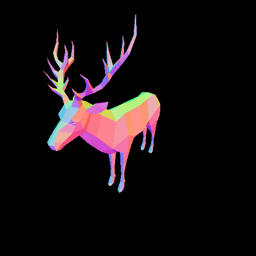

# Raytracer

В рамках своего проекта я разработал игрушечный трассировщик лучей (raytracer), позволяющий рендерить простые трехмерные сцены. Проект был структурирован на несколько логических компонентов, что позволило поэтапно реализовать все необходимые функции.

## Структура проекта

Для реализации полнофункционального трассировщика я создал несколько модулей:
- **Геометрический модуль** - для работы с векторами, лучами и геометрическими примитивами
- **Модуль чтения сцен** - для загрузки описаний сцен из файлов
- **Отладочный модуль** - для тестирования основных компонентов
- **Основной модуль рендеринга** - реализующий алгоритм трассировки лучей

Главной частью проекта является функция:
```cpp
Image Render(const std::filesystem::path& path, const CameraOptions& camera_options, const RenderOptions& render_options);
```

## Реализованные возможности

### Физическая модель освещения

В своей реализации я использовал расширенную модель освещения Фонга, которая включает:
- Фоновое освещение (ambient)
- Собственное свечение объектов (emissive)
- Диффузное отражение (diffuse)
- Зеркальное отражение (specular)
- Расчет отраженных лучей
- Расчет преломленных лучей для прозрачных объектов

Освещенность в точке p рассчитывается по формуле:
```
I_p = I_base(p) + I_comp(p)
```

где `I_base` - базовая освещенность от источников света, а `I_comp` - составляющая от отраженных и преломленных лучей.

### Постобработка изображения

Для получения качественного изображения я реализовал два важных этапа постобработки:

1. **Tone Mapping** - для преобразования произвольного диапазона значений RGB в диапазон [0, 1], используя нелинейное преобразование:
   ```
   V_out = (V_in * (1 + V_in/C²)) / (1 + V_in)
   ```
   где C - максимальное значение среди всех RGB компонентов изображения.

2. **Гамма-коррекция** - для компенсации нелинейности восприятия человеческого глаза:
   ```
   V_gamma = V_out^(1/2.2)
   ```

## Техническая реализация

Для работы с изображениями я использовал библиотеки libjpeg и libpng. Это позволило эффективно сохранять результаты рендеринга в распространенных форматах.

Для оптимизации производительности я применил ряд алгоритмических приемов, включая раннее отсечение невидимых объектов и кэширование промежуточных расчетов.

## Результаты

В результате работы над проектом мне удалось создать трассировщик лучей, способный визуализировать различные трехмерные сцены с такими эффектами, как тени, отражения и преломления. Особенно впечатляюще выглядят сцены с прозрачными сферами и множественными источниками света.


